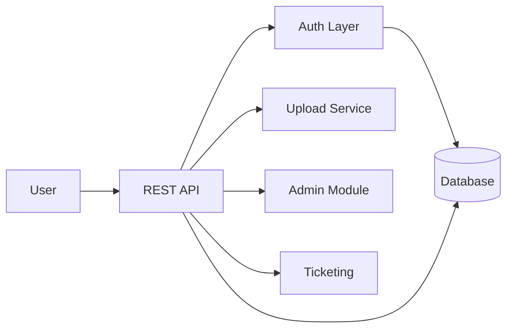

# application-security-review-lab

`application-security-review-lab` is a defensive AppSec portfolio project built around an intentionally vulnerable Java Spring Boot telecom-style API.  
The goal is to present the project as a lightweight but realistic security assessment package, not a CTF.

## Why this project was built

Most portfolio security labs stop at "here are vulnerabilities." This repository goes one step further:

- treats the API as a review target with business context
- documents findings in assessment format
- shows validation notes and practical remediation guidance
- provides secure Java rewrite examples for common issues

## AppSec skills demonstrated

- Threat modeling and architecture-driven review
- Manual secure code review in Java/Spring Boot
- Risk-based vulnerability reporting and prioritization
- SAST and DAST scoping with validation notes
- Developer-focused remediation planning
- OWASP API Security Top 10 (2023) mapping

## Architecture summary

- Stack: Java 17, Spring Boot, H2 in-memory database
- Domain: customer profile, billing, ticketing, admin, and file upload workflows
- Security-relevant layers:
  - `controller/` API entry points and request handling
  - `service/` authorization and business logic decisions
  - `repository/` SQL access patterns
  - `security/` token issuing and validation flow



## API overview

- `POST /login`
- `GET /customers/{id}`
- `GET /billing/{accountId}`
- `POST /tickets`
- `GET /tickets`
- `GET /admin/users`
- `POST /files/upload`

## Vulnerability overview

The lab intentionally includes high-value API risks that commonly appear in real backend reviews:

- IDOR / Broken Object Level Authorization
- Broken Function Level Authorization
- SQL injection in query construction
- Stored/reflected XSS exposure in ticket content handling
- Weak JWT validation logic
- Missing server-side input validation
- Insecure file upload handling
- Hardcoded secrets and weak configuration hygiene

## How to run

Prerequisites:

- Java 17+
- Maven 3.9+

Run locally:

```bash
cd app/vulnerable-telecom-api
mvn spring-boot:run
```

Default endpoints:

- API: `http://localhost:8080`
- H2 console: `http://localhost:8080/h2-console`

Use this application only in a controlled local environment.

## How to review this project

1. Start with [docs/threat-model.md](docs/threat-model.md) and [docs/methodology.md](docs/methodology.md).
2. Read the assessment output in [docs/executive-summary.md](docs/executive-summary.md) and [docs/findings-report.md](docs/findings-report.md).
3. Cross-check root causes in [code-review/java-findings.md](code-review/java-findings.md).
4. Use [evidence/](evidence/) and [secure-examples/](secure-examples/) for validation context and secure rewrites.
5. Review testing guidance in [sast/](sast/) and [dast/](dast/).

## Documentation map

- Assessment summary: `docs/executive-summary.md`
- Threat model: `docs/threat-model.md`
- Architecture review notes: `docs/architecture-review.md`
- Review methodology: `docs/methodology.md`
- Detailed findings: `docs/findings-report.md`
- Remediation guide: `docs/remediation-guide.md`
- API Top 10 mapping notes: `docs/api-security-notes.md`
- Risk register: `docs/risk-register.md`
- Source review notes: `code-review/java-findings.md`
- Secure Java snippets: `secure-examples/*.java`
- Validation evidence notes: `evidence/*.md`
- SAST package: `sast/*`
- DAST package: `dast/*`

## Future improvements

- Add secure branch with remediated implementation and regression tests.
- Integrate CI security gates (Semgrep + SCA + unit security tests).
- Expand auth model to include refresh tokens and stronger claim validation.
- Add API gateway-style controls (rate limiting, request normalization, centralized authn/z).
- Add retest report template to document post-remediation verification.
